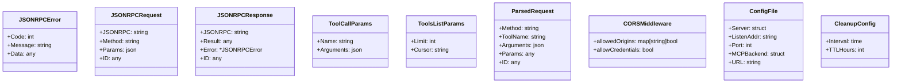

```mermaid
classDiagram
    class JSONRPCError {
        +Code: int
        +Message: string
        +Data: any
    }

    class JSONRPCRequest {
        +JSONRPC: string
        +Method: string
        +Params: json
        +ID: any
    }

    class JSONRPCResponse {
        +JSONRPC: string
        +Result: any
        +Error: *JSONRPCError
        +ID: any
    }

    class ToolCallParams {
        +Name: string
        +Arguments: json
    }

    class ToolsListParams {
        +Limit: int
        +Cursor: string
    }

    class ParsedRequest {
        +Method: string
        +ToolName: string
        +Arguments: json
        +Params: any
        +ID: any
    }

    class CORSMiddleware {
        +allowedOrigins: map[string]bool
        +allowCredentials: bool
    }

    class ConfigFile {
        +Server: struct
        +ListenAddr: string
        +Port: int
        +MCPBackend: struct
        +URL: string
    }

    class CleanupConfig {
        +Interval: time
        +TTLHours: int
    }

```