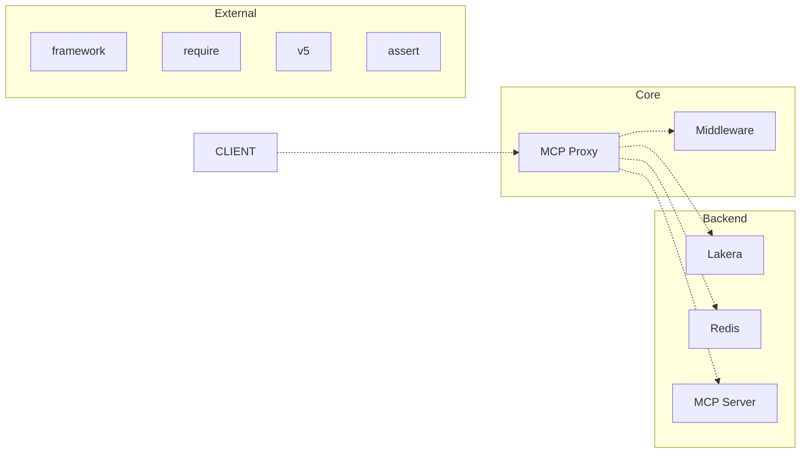

```mermaid
flowchart LR
    subgraph External
        FRAMEWORK["framework"]
        REQUIRE["require"]
        V5["v5"]
        ASSERT["assert"]
    end

    subgraph Core
        PROXY["MCP Proxy"]
        MW["Middleware"]
    end

    subgraph Backend
        LAKERA["Lakera"]
        REDIS["Redis"]
        MCP["MCP Server"]
    end

    CLIENT -.-> PROXY
    PROXY -.-> MW
    PROXY -.-> LAKERA
    PROXY -.-> REDIS
    PROXY -.-> MCP

```