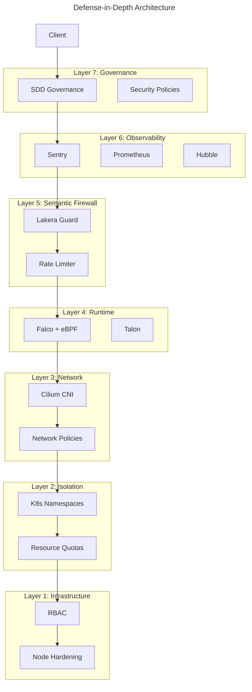

```mermaid
---
title: Defense-in-Depth Architecture
---
graph TD
    subgraph "Layer 7: Governance"
        SDD["SDD Governance"]
        Policy["Security Policies"]
    end

    subgraph "Layer 6: Observability"
        OBS1["Sentry"]
        OBS2["Prometheus"]
        OBS3["Hubble"]
    end

    subgraph "Layer 5: Semantic Firewall"
        SF["Lakera Guard"]
        RL["Rate Limiter"]
    end

    subgraph "Layer 4: Runtime"
        RT["Falco + eBPF"]
        Tal["Talon"]
    end

    subgraph "Layer 3: Network"
        NC["Cilium CNI"]
        NP["Network Policies"]
    end

    subgraph "Layer 2: Isolation"
        ISO["K8s Namespaces"]
        Quota["Resource Quotas"]
    end

    subgraph "Layer 1: Infrastructure"
        RBAC["RBAC"]
        Hard["Node Hardening"]
    end

    Client --> SDD
    SDD --> OBS1
    OBS1 --> SF
    SF --> RL
    RL --> RT
    RT --> NC
    NC --> NP
    NP --> ISO
    ISO --> Quota
    Quota --> RBAC
    RBAC --> Hard
```