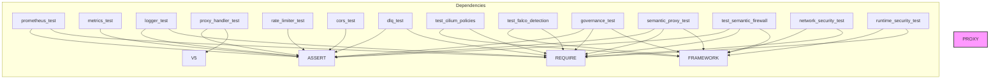

```mermaid
flowchart BT
    style PROXY fill:#f9f,stroke:#333,stroke-width:2px
    subgraph Dependencies
        prometheus_test --> REQUIRE
        prometheus_test --> ASSERT
        metrics_test --> ASSERT
        logger_test --> REQUIRE
        logger_test --> ASSERT
        proxy_handler_test --> V5
        proxy_handler_test --> ASSERT
        rate_limiter_test --> ASSERT
        cors_test --> ASSERT
        dlq_test --> REQUIRE
        dlq_test --> ASSERT
        test_cilium_policies --> REQUIRE
        test_cilium_policies --> FRAMEWORK
        test_falco_detection --> REQUIRE
        test_falco_detection --> FRAMEWORK
        governance_test --> FRAMEWORK
        governance_test --> REQUIRE
        governance_test --> ASSERT
        semantic_proxy_test --> FRAMEWORK
        semantic_proxy_test --> REQUIRE
        semantic_proxy_test --> ASSERT
        test_semantic_firewall --> FRAMEWORK
        test_semantic_firewall --> REQUIRE
        test_semantic_firewall --> ASSERT
        network_security_test --> REQUIRE
        network_security_test --> FRAMEWORK
        runtime_security_test --> REQUIRE
        runtime_security_test --> FRAMEWORK
    end

```