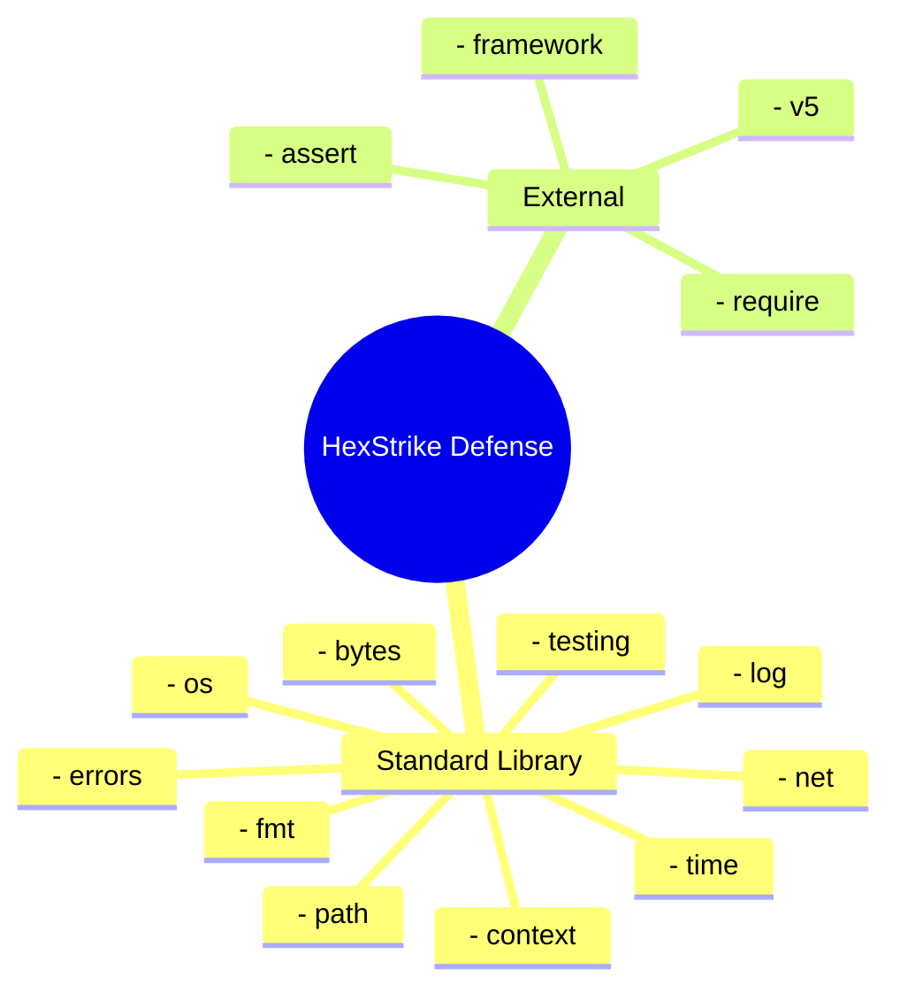

```mermaid
mindmap
  root((HexStrike Defense))
    Standard Library
      - bytes
      - context
      - errors
      - fmt
      - log
      - net
      - os
      - path
      - testing
      - time
    External
      - assert
      - framework
      - require
      - v5
```