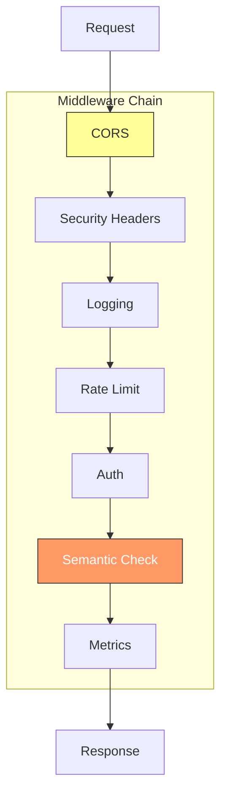

```mermaid
flowchart TB
    subgraph "Middleware Chain"
        M1[CORS]
        M2[Security Headers]
        M3[Logging]
        M4[Rate Limit]
        M5[Auth]
        M6[Semantic Check]
        M7[Metrics]
    end

    Request --> M1
    M1 --> M2
    M2 --> M3
    M3 --> M4
    M4 --> M5
    M5 --> M6
    M6 --> M7
    M7 --> Response

    style M1 fill:#ff9,stroke:#333
    style M6 fill:#f96,stroke:#333,color:#fff
```