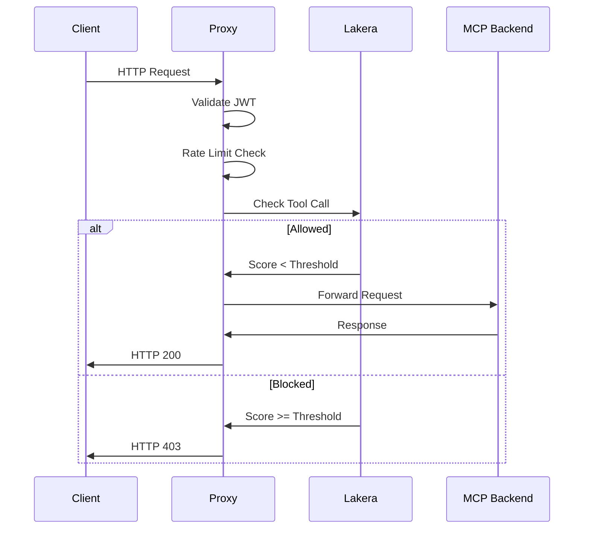

```mermaid
sequenceDiagram
    participant C as Client
    participant P as Proxy
    participant L as Lakera
    participant M as MCP Backend

    C->>P: HTTP Request
    P->>P: Validate JWT
    P->>P: Rate Limit Check
    P->>L: Check Tool Call
    alt Allowed
        L->>P: Score < Threshold
        P->>M: Forward Request
        M->>P: Response
        P->>C: HTTP 200
    else Blocked
        L->>P: Score >= Threshold
        P->>C: HTTP 403
    end
```