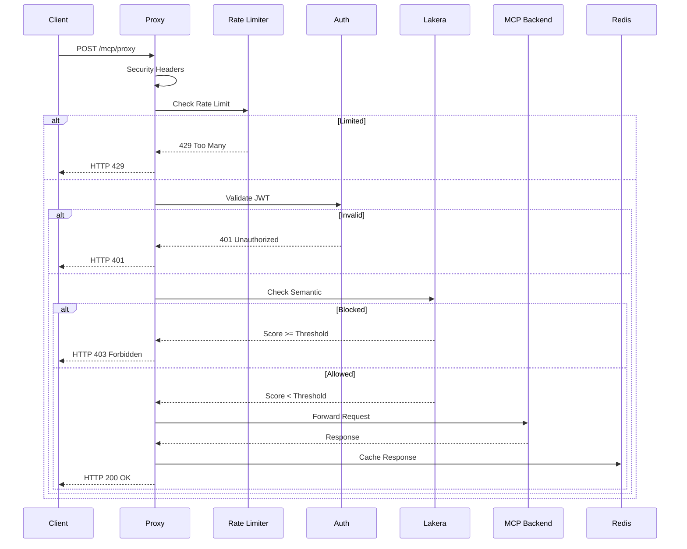

```mermaid
sequenceDiagram
    participant C as Client
    participant P as Proxy
    participant RL as Rate Limiter
    participant A as Auth
    participant L as Lakera
    participant M as MCP Backend
    participant R as Redis

    C->>P: POST /mcp/proxy
    P->>P: Security Headers
    P->>RL: Check Rate Limit
    alt Limited
        RL-->>P: 429 Too Many
        P-->>C: HTTP 429
    else
        P->>A: Validate JWT
        alt Invalid
            A-->>P: 401 Unauthorized
            P-->>C: HTTP 401
        else
            P->>L: Check Semantic
            alt Blocked
                L-->>P: Score >= Threshold
                P-->>C: HTTP 403 Forbidden
            else Allowed
                L-->>P: Score < Threshold
                P->>M: Forward Request
                M-->>P: Response
                P->>R: Cache Response
                P-->>C: HTTP 200 OK
            end
        end
    end
```