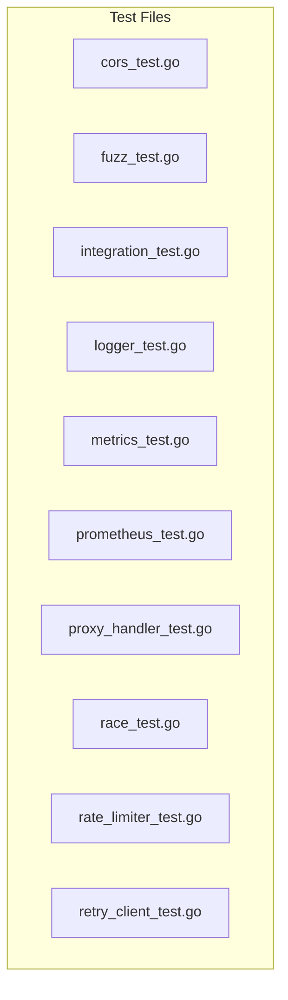

```mermaid
graph TD
    subgraph Test Files
        Tcors["cors_test.go"]
        Tfuzz["fuzz_test.go"]
        Tintegration["integration_test.go"]
        Tlogger["logger_test.go"]
        Tmetrics["metrics_test.go"]
        Tprometheus["prometheus_test.go"]
        Tproxy_handler["proxy_handler_test.go"]
        Trace["race_test.go"]
        Trate_limiter["rate_limiter_test.go"]
        Tretry_client["retry_client_test.go"]
    end
```