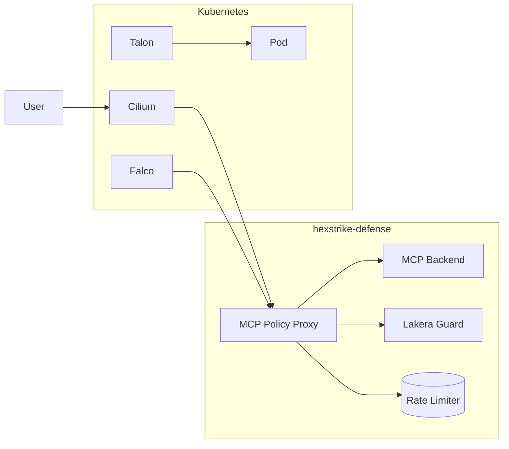

# High-Level Architecture

## Defense-in-Depth Layers

```mermaid
graph TD
    subgraph "Layer 7: SDD Governance"
        SDD[Spec-Driven Development]
    end

    subgraph "Layer 6: Observability"
        OBS[Sentry MCP | Prometheus]
    end

    subgraph "Layer 5: Semantic Firewall"
        SF[Lakera Guard | Rate Limiting]
    end

    subgraph "Layer 4: Runtime Detection"
        RT[Falco + Talon]
    end

    subgraph "Layer 3: Network Containment"
        NC[Cilium CNI | Zero Trust]
    end

    subgraph "Layer 2: Agent Isolation"
        ISO[Kubernetes Namespaces]
    end

    subgraph "Layer 1: Infrastructure"
        INF[Node Hardening | RBAC]
    end

    User --> SF
    SF --> RT
    RT --> NC
    NC --> ISO
    ISO --> INF
```

## Component Architecture



## Security Layers

| Layer | Component | Function |
|-------|----------|----------|
| 7 | SDD Governance | Security requirements captured first |
| 6 | Observability | Monitoring and alerting |
| 5 | Semantic Firewall | Input validation |
| 4 | Runtime Detection | Behavioral monitoring |
| 3 | Network Containment | Zero-trust networking |
| 2 | Agent Isolation | Namespace isolation |
| 1 | Infrastructure | Node hardening |

## Request Flow

```
User Request
     │
     ▼
┌────────────────────┐
│ Layer 1: RBAC      │
└────────────────────┘
     │
     ▼
┌────────────────────┐
│ Layer 2: Namespace  │
└────────────────────┘
     │
     ▼
┌────────────────────┐
│ Layer 3: Cilium     │
└────────────────────┘
     │
     ▼
┌────────────────────┐
│ Layer 4: Falco      │
└────────────────────┘
     │
     ▼
┌────────────────────┐
│ Layer 5: Proxy     │
└────────────────────┘
     │
     ▼
┌────────────────────┐
│ MCP Backend        │
└────────────────────┘
```

---

*Generated from code analysis*
