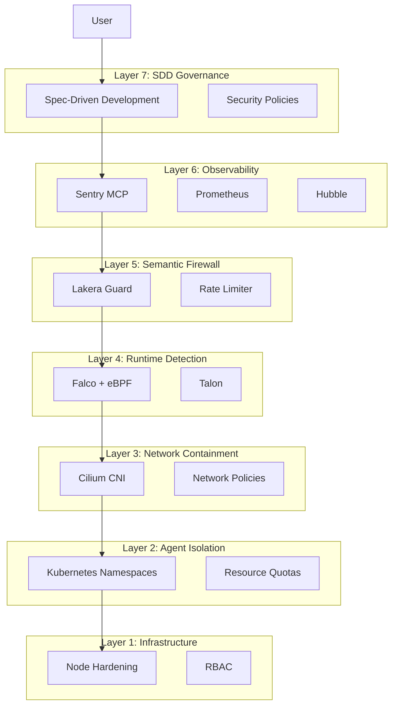
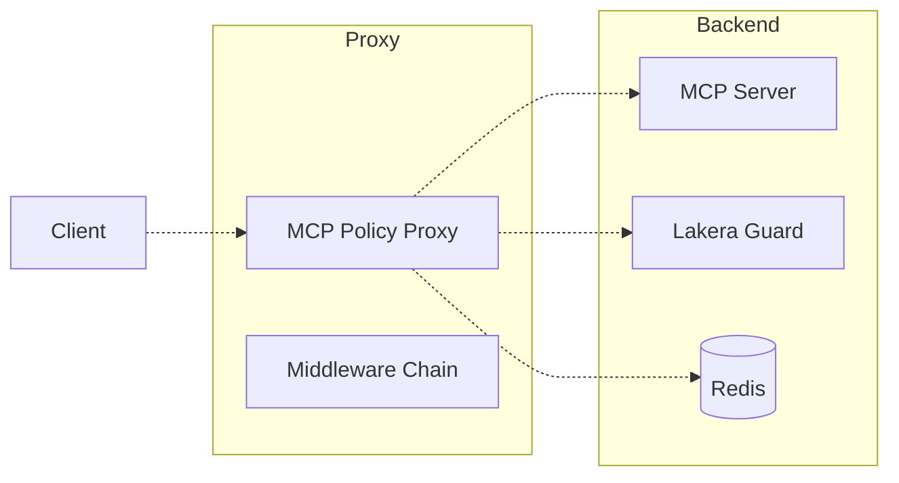
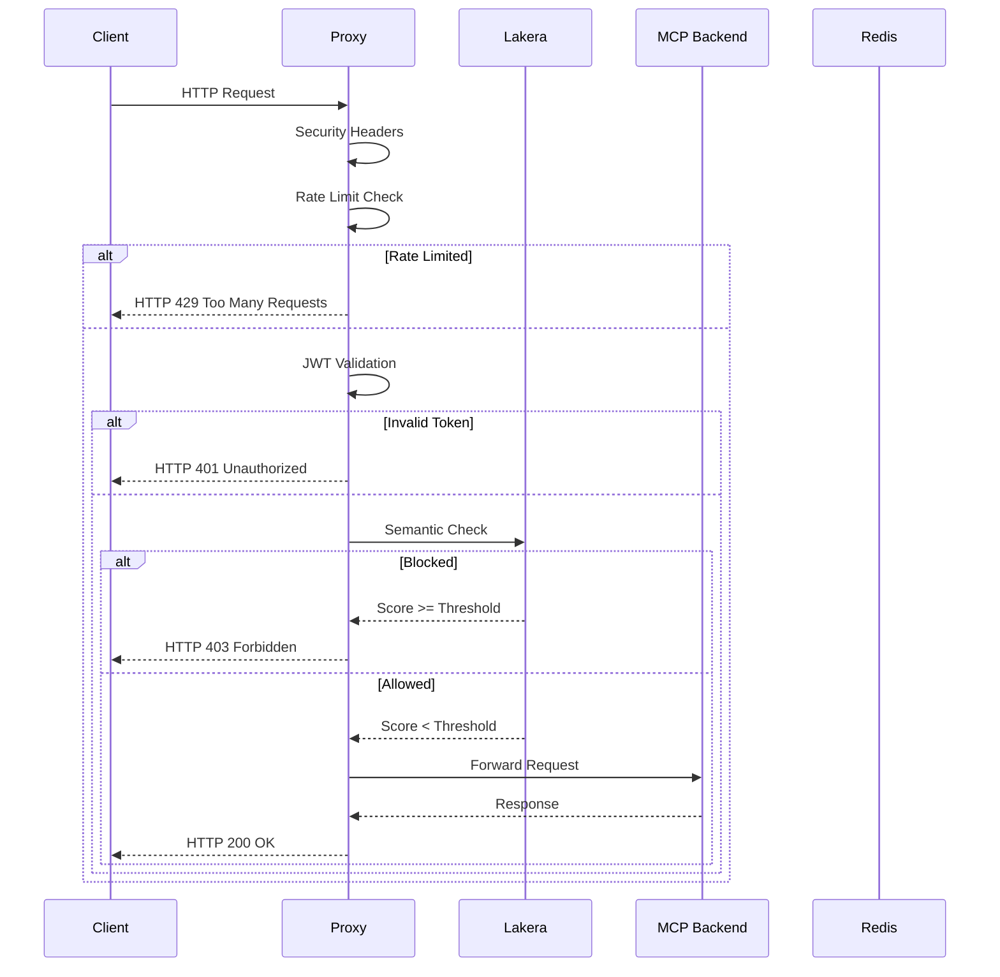

# High-Level Architecture

## Defense-in-Depth Layers

## Component Architecture

## Request Processing Flow

## Security Layers

| Layer | Component | Function | Status |
|-------|-----------|----------|--------|
| 7 | SDD Governance | Security requirements captured first | ✓ Active |
| 6 | Observability | Monitoring and alerting | ✓ Active |
| 5 | Semantic Firewall | Input validation | ✓ Active |
| 4 | Runtime Detection | Behavioral monitoring | ✓ Active |
| 3 | Network Containment | Zero-trust networking | ✓ Active |
| 2 | Agent Isolation | Namespace isolation | ✓ Active |
| 1 | Infrastructure | Node hardening | ✓ Active |

## Design Principles

1. **Defense in Depth** - Multiple security layers
2. **Fail Secure** - Fail-closed by default
3. **Least Privilege** - Minimal permissions
4. **Zero Trust** - Never trust, always verify
5. **Observable** - Full visibility into system state

---

*Generated from code analysis*
