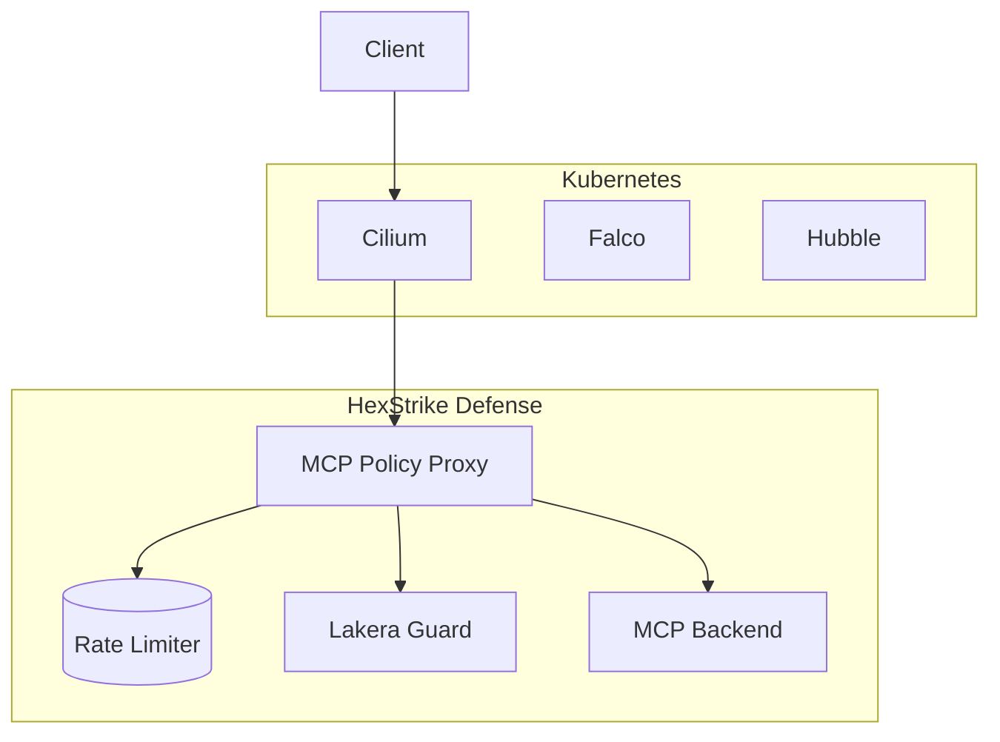

# Project Overview

## Project Information

| Property | Value |
|----------|-------|
| **Name** | hexstrike-defense |
| **Type** | Multi-layer security architecture for AI agents |
| **Version** | 1.0.0 |
| **Primary Languages** | Markdown, Go, YAML |
| **License** | Proprietary |
| **Repository** | /home/runner/work/hexstrike-defense/hexstrike-defense |

## Purpose


## Key Features

- **7-layer security architecture** - Comprehensive defense strategy
- **MCP Policy Proxy** (Go) - Semantic firewall for tool calls
- **Kubernetes-native** - Deployment with Cilium, Falco, Talos
- **SDD Governance** - Spec-Driven Development methodology
- **Observability** - Prometheus, Sentry, Hubble integration
- **Zero Trust Networking** - Cilium CNI with network policies

## Technology Stack

| Layer | Technology | Purpose |
|-------|------------|---------|
| Language | Go 1.21+ | Primary implementation |
| Orchestration | Kubernetes | Container orchestration |
| Network Policy | Cilium CNI | eBPF-based networking |
| Runtime Security | Falco + eBPF | Behavioral monitoring |
| Semantic Firewall | Lakera Guard | Input validation |
| Observability | Prometheus, Sentry | Metrics and logging |
| Protocol | MCP | AI agent communication |

## Architecture Highlights



## Quick Start

```bash
# Clone the repository
git clone https://github.com/hexstrike/defense.git
cd defense

# Build the proxy
make build

# Run tests
make test

# Deploy to Kubernetes
./scripts/deploy.sh

# Verify deployment
./scripts/validate.sh
```

## Prerequisites

| Requirement | Version | Notes |
|------------|---------|-------|
| Go | 1.21+ | Latest stable |
| Docker | Latest | For container builds |
| Kubernetes | 1.24+ | K8s cluster |
| kubectl | Latest | Kubernetes CLI |
| Helm | 3.10+ | Package manager |

## Project Structure

```
hexstrike-defense/
├── src/                    # Source code
│   └── mcp-policy-proxy/   # Main proxy
├── manifests/              # Kubernetes manifests
├── scripts/                # Deployment scripts
├── docs/                   # Documentation
├── tests/                  # Test suites
└── Makefile               # Build automation
```

---

*Generated from repository analysis*
